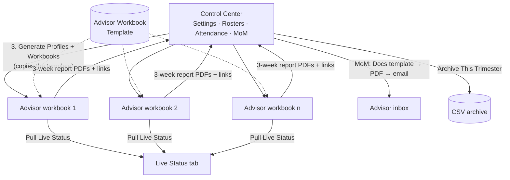
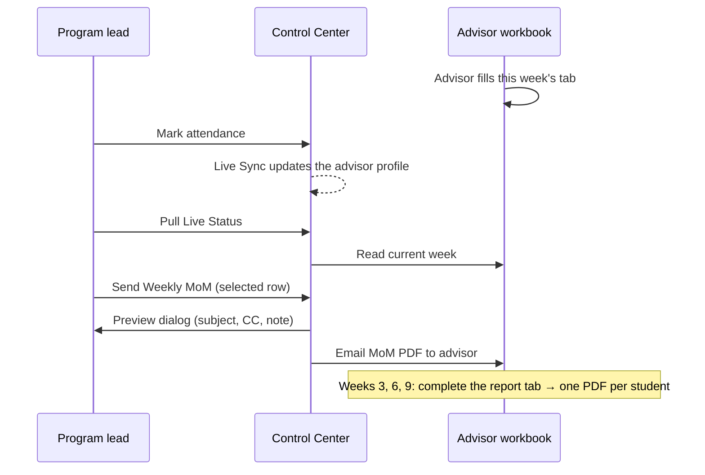

# Advisor Program Manager


A Google Sheets and Apps Script system for running a **student advisory program**. In the program, each advisor meets a small group of students every week, logs their progress and writes a short report every three weeks.

One **Control Center** workbook, run by the program lead, generates a **personal workbook for every advisor**. It tracks attendance and live status across all advisors, produces Minutes of Meeting (MoM) documents and emails them as PDFs, and archives everything at the end of each term.

---

## Screenshots

> Illustrations generated by running the project's real code against **fictional sample data**. No real school, staff or student data is included.

📖 **[Read the full illustrated guide](docs/GUIDE.md)**: every screen, tab, menu item, dialog and email, explained.

**Control Center dashboard: weekly KPIs, quick links and pending meetings**


**Live Status: every advisor's student updates in one view**


**Advisor workbook: 3-week report tab that generates one PDF per student**


**MoM preview before sending**


### Menus

**Control Center menu**


**Advisor workbook menu**


## Features

**Control Center (program lead)**
- One-time initialization builds the Dashboard, Settings, Trimester Reference, Advisor Roster, Student Roster, Attendance, MoM Log and Email Log tabs.
- **Auto-generates one workbook per advisor** from a template, with a Dashboard, a tab for each advisory week (1–10) and report tabs for Weeks 3, 6 and 9.
- **Advisor profiles** with a weekly checklist and status, plus a sandbox profile for safe testing.
- **Live status pull** from every advisor workbook into one summary, so there's no need to open each file.
- **Attendance → Profiles live sync** through an installable trigger.
- **MoM generation**: fills a Google Docs template with `{{TAGS}}`, duplicates the students table row per student, and lets you add a feedback note in a preview popup. It then exports a PDF and emails it.
- **Email log** of every send, and a footer you can configure from Settings.
- **End-of-term archive**: exports working sheets to CSV, then clears weekly values while keeping rosters and settings.

**Advisor workbook (each advisor)**
- Weekly tabs for meeting notes per student.
- **3-week reports**: once every student's Trend, Key Concern and Recommendation is filled in, the workbook asks the advisor to confirm. It then builds **one PDF per student** from the report template, saves them in the advisor's Drive folder and links them back to the Control Center.

## Architecture



### Weekly cycle



```
src/
├── control-center/      # bound to the main Control Center sheet
│   ├── Main_01_Setup.gs                     menu, Settings, initialization
│   ├── Main_02_TrimesterReference.gs        term/week calendar (sample data)
│   ├── Main_03_Roster.gs                    advisor + student rosters
│   ├── Main_04_Dashboard_Attendance_Logs.gs dashboard, attendance, live status, logs
│   ├── Main_05_Profiles.gs                  advisor profiles + theme
│   ├── Main_06_ChildWorkbooks.gs            advisor workbook generation
│   ├── Main_07_MoM.gs                       MoM Docs, PDF and email
│   └── Main_08_Archive.gs                   end-of-term archive
└── advisor-template/
    └── Child_Code.gs    # bound to the blank Advisor Workbook Template sheet
```

## Setup

### 1. Control Center
1. Create a Google Sheet called *Advisor Workbook Control Center*.
2. Open **Extensions → Apps Script** and add every file from `src/control-center/`.
3. Reload the sheet and run **Advisor System → 1. Initialize Workbook (run once)**.
4. Fill in the **Settings** tab:
   - names and emails for the program lead, principals and other CC contacts (set each to *Active* or *Not Active*)
   - term number, weeks per trimester and academic year
   - Drive folder IDs (advisor workbooks, archive, MoM output, reports)
   - Google Docs template IDs (MoM, 3-week report, advisor checklist)
5. Replace the **sample dates** in `Main_02_TrimesterReference.gs` with your school calendar.

### 2. Advisor workbook template (one time)
1. Create a blank Google Sheet called *Advisor Workbook Template*.
2. Open **Extensions → Apps Script** and paste `src/advisor-template/Child_Code.gs`.
3. Copy the template's file ID into Settings → **Advisor Workbook Template Spreadsheet ID**.

### 3. Run the program
1. Enter advisors in **Advisor Roster** and students in **Student Roster**.
2. Run **2. Generate Advisor Roster**, then **3. Generate Advisor Profiles + Workbooks**.
3. Run **Enable Live Sync** once, and ask each advisor to run **Advisor → Enable Auto-Sync** once in their workbook.
4. Each week, use **Pull Live Status from Advisor Workbooks** and **Send Weekly MoM for Selected Row**.
5. At the end of the term, run **Archive This Trimester**.

### MoM template tags

`{{DATE}} {{TIME}} {{LOCATION}} {{ADVISOR_NAME}} {{DIVISION}} {{GENERAL_NOTES}} {{FOLLOWUP_ACTIONS}} {{NEXT_MEETING_DATE}}`, plus a students table whose single data row contains `{{STUDENT_NAME}} | {{STATUS_UPDATE}} | {{CONCERNS}} | {{NEXT_STEPS}}`.

## Privacy

The repository contains **no names, emails, student data or Drive IDs**. The Student Roster tab is meant to stay private to the program lead.

## License

[MIT](LICENSE) © Randa ELGawish

## Author

**Randa ELGawish**, Academic leader and EdTech developer
[LinkedIn](https://www.linkedin.com/in/randaelgawishegy) · [GitHub](https://github.com/RandaELGawish93)
