# Advisor Program Manager: illustrated guide

How the Control Center and the advisor workbooks work together, explained screen by screen.

> Every picture in this guide is an **illustration filled with fictional sample data** (names like *Sarah Collins*, emails at `example.edu`). No real school, staff or student data appears anywhere in this repository.

## Contents

- [Menus](#menus)
- [Control Center tabs](#control-center-tabs)
- [Advisor workbook tabs](#advisor-workbook-tabs)
- [Minutes of Meeting email](#minutes-of-meeting-email)
- [Confirmation messages](#confirmation-messages)

## Menus

The program uses two workbooks, and each has its own menu.

### Control Center: Advisor System menu

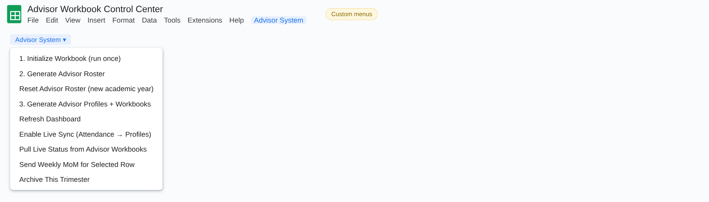

| Item | What it does |
|---|---|
| **1. Initialize Workbook (run once)** | Builds the Dashboard, Settings, Trimester Reference, Advisor Roster, Student Roster, Attendance, MoM Log and Email Log tabs. |
| **2. Generate Advisor Roster** | Reads the Student Roster and fills the Advisor Roster, Attendance and MoM Log with one row per advisor, including student counts. |
| **Reset Advisor Roster (new academic year)** | After a confirmation, clears advisors and students so you can enter the new year's lists. |
| **3. Generate Advisor Profiles + Workbooks** | Creates a profile tab for each advisor in the Control Center and copies the template to give each advisor a personal workbook in Drive. Anything an advisor had already filled in is preserved. |
| **Refresh Dashboard** | Recalculates the dashboard KPIs and the list of meetings not yet marked complete. |
| **Enable Live Sync (Attendance → Profiles)** | Installs a trigger so that marking attendance updates the matching advisor profile instantly. |
| **Pull Live Status from Advisor Workbooks** | Reads the current week's tab in every advisor workbook and rebuilds the Live Status tab. |
| **Send Weekly MoM for Selected Row** | Click an advisor's row in Attendance or MoM Log first. Asks for the week, fills the Google Docs MoM template, shows a preview, then emails the PDF. |
| **Archive This Trimester** | Exports the working tabs to CSV in the archive folder, then clears the weekly values while keeping rosters and settings. |

### Advisor workbook: Advisor menu

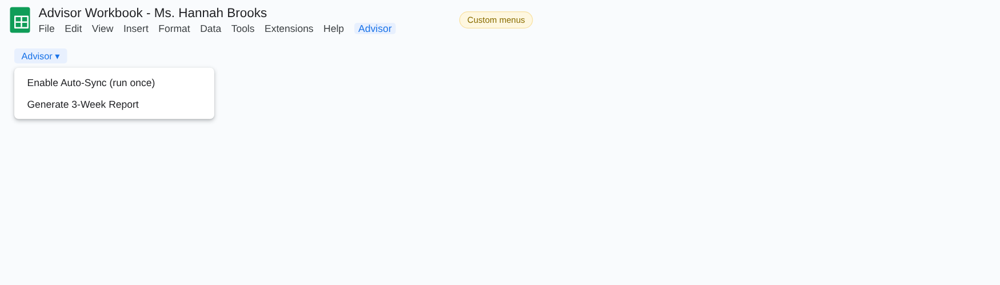

| Item | What it does |
|---|---|
| **Enable Auto-Sync (run once)** | Installs the edit trigger that sends status changes back to the Control Center and watches the report tabs. |
| **Generate 3-Week Report** | Asks for week 3, 6 or 9 and builds one PDF report per student from the report template. |

## Control Center tabs

### Dashboard

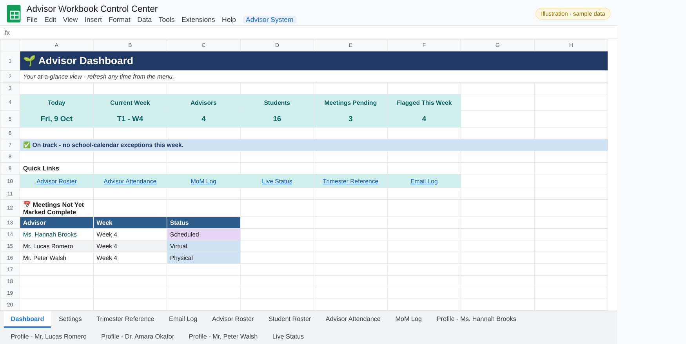

Today's date and current week, the number of advisors and students, meetings pending and students flagged this week. A banner says whether the week is a normal advisory week or an exception (break or exams). Quick links jump to each tab, and a list shows the meetings not yet marked complete.

### Settings

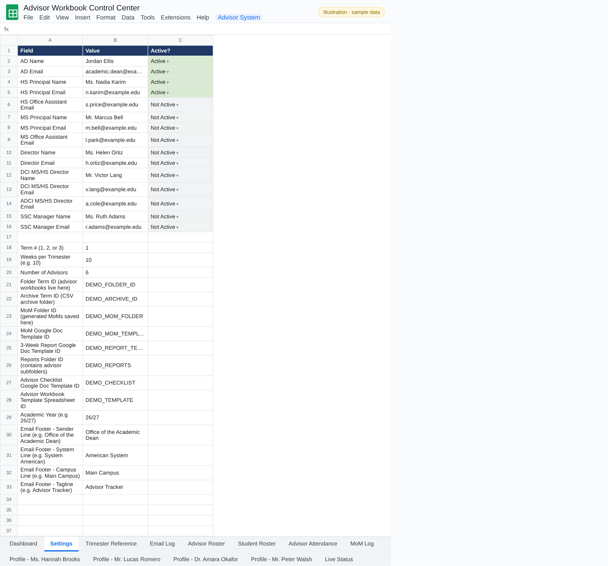

CC contacts (each *Active* or *Not Active*), the term number, weeks per trimester and academic year, Drive folder IDs, Google Docs template IDs and the email footer lines.

### Trimester Reference

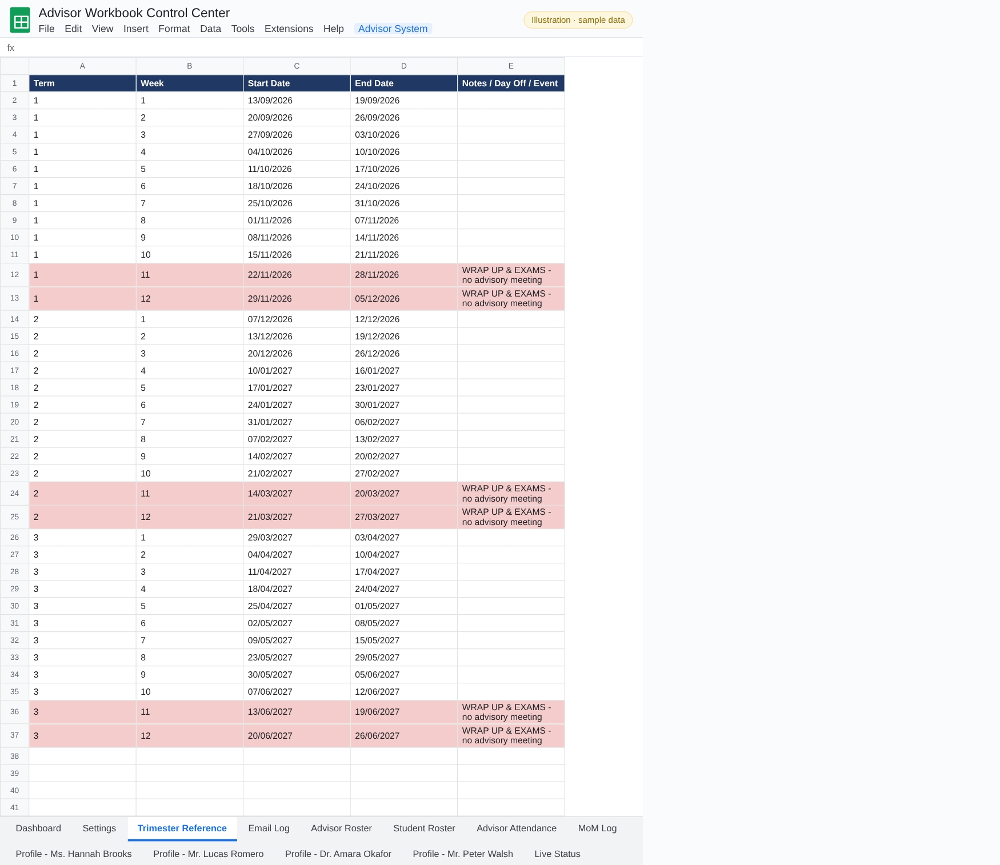

The school calendar: the start and end date of every week in each term. Weeks with no advisory meeting (wrap-up and exam weeks) are highlighted, and the dashboard uses this tab to know the current week.

### Advisor Roster

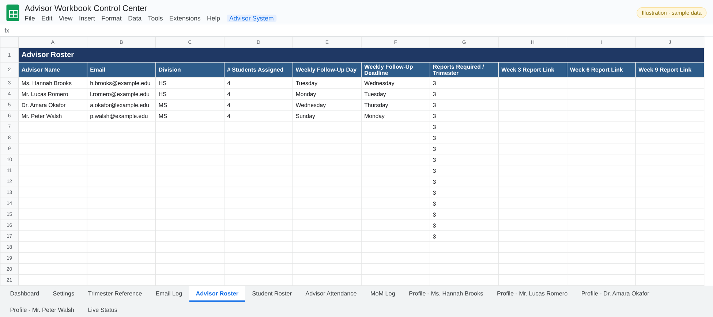

One row per advisor: email, division, number of students, weekly follow-up and deadline days, plus links to the Week 3, 6 and 9 reports once they exist.

### Student Roster

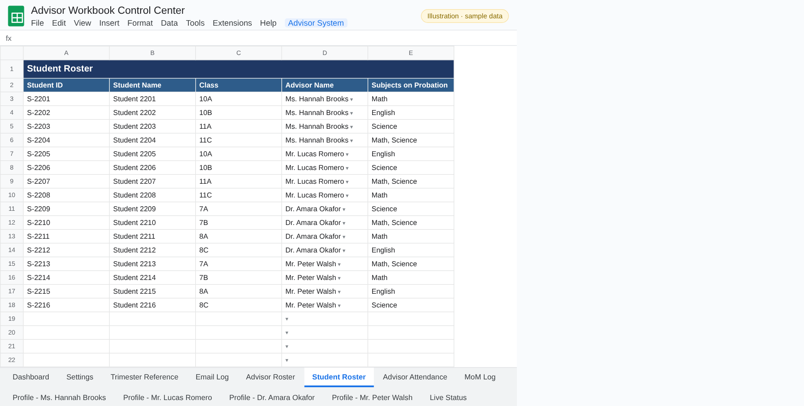

Every student with class, assigned advisor and the subjects they are on probation for. This tab should stay private to the program lead.

### Attendance

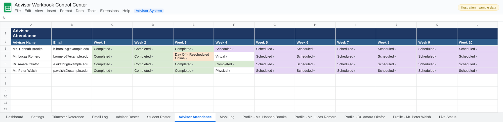

Each advisor's weekly meeting status (Completed, Scheduled, Day Off – Rescheduled, Virtual…). With Live Sync on, changes appear on the advisor's profile immediately.

### Advisor profile

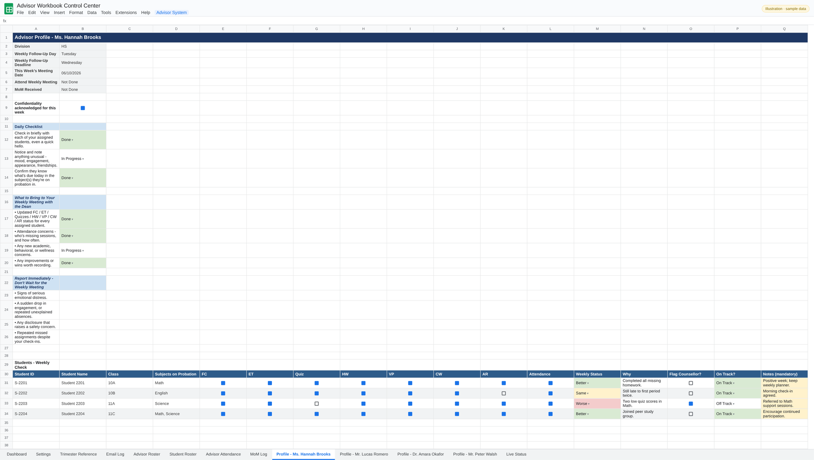

One tab per advisor: meeting day and deadline, this week's checklist with status, notes to bring to the meeting and a weekly table of their students (attendance per subject, status, why, flag to counsellor and notes).

### Live Status

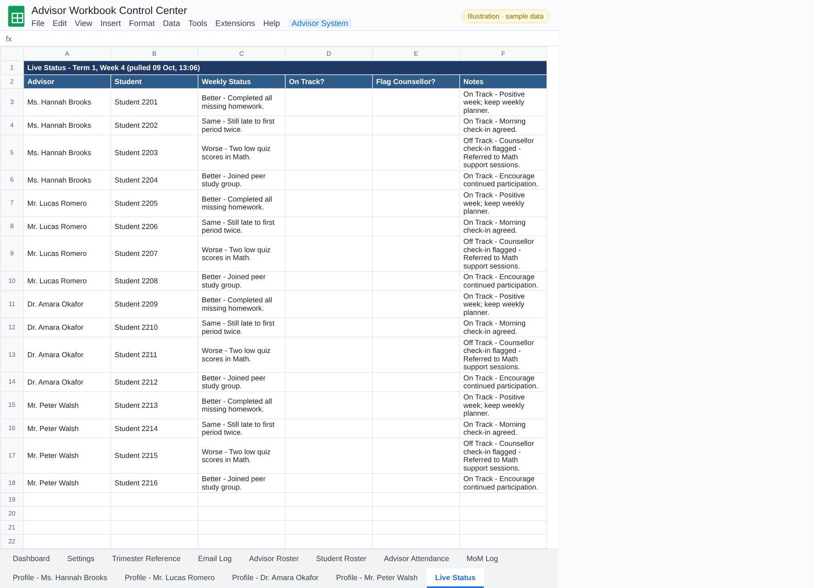

Pulled from every advisor workbook in one click: each student's weekly status, whether they are on track, any flag to the counsellor and the advisor's notes.

### MoM Log

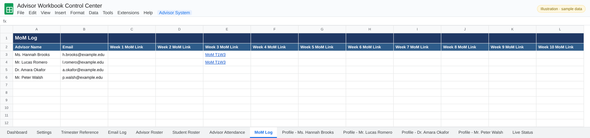

A link to every generated Minutes of Meeting document, per advisor and per week.

### Email Log

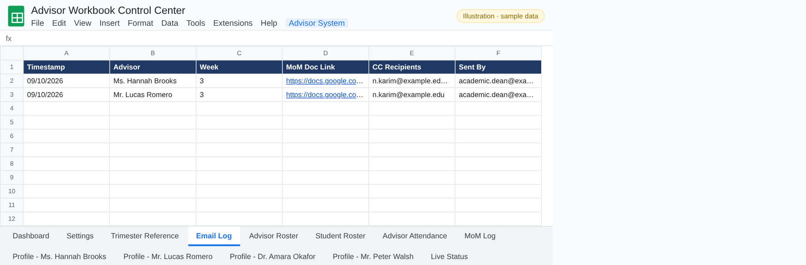

Every MoM email sent: date, advisor, week, document link, CC recipients and sender.

## Advisor workbook tabs

Each advisor receives a personal copy of the template.

### Advisor dashboard

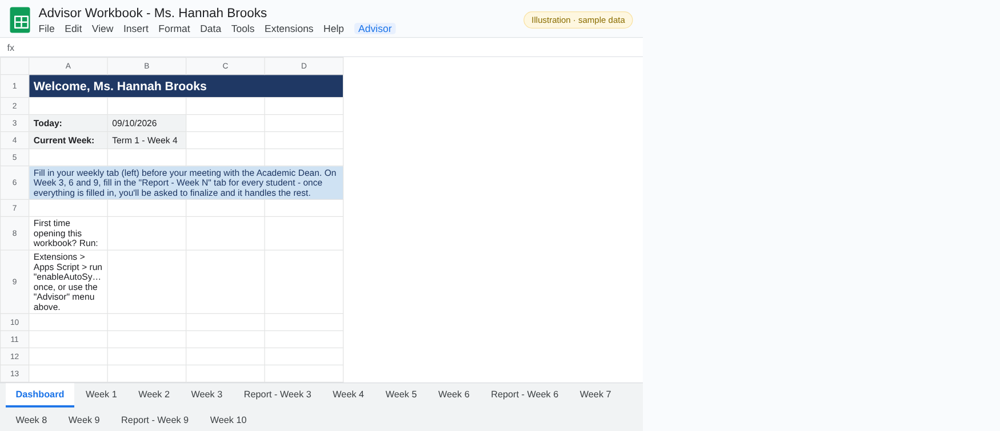

A welcome page with today's date, the current week and short instructions.

### Weekly tab (Week 4 shown)

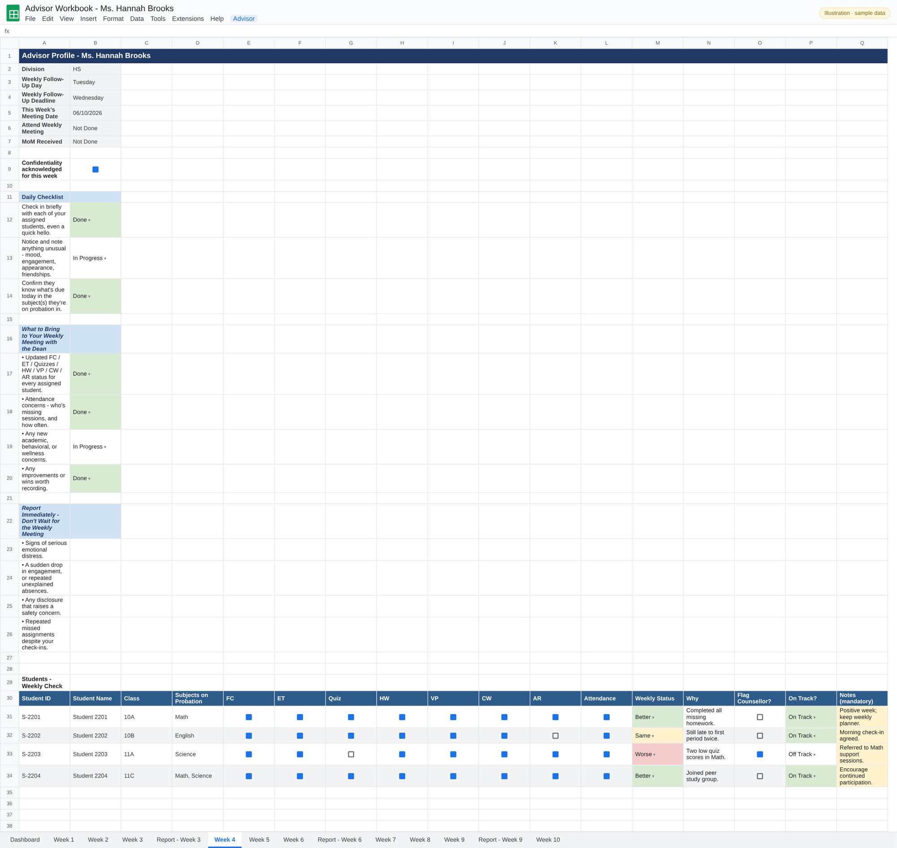

The advisor fills this in before each meeting: checklist items, notes and a row per student. The Control Center reads it when the lead pulls live status.

### 3-week report tab

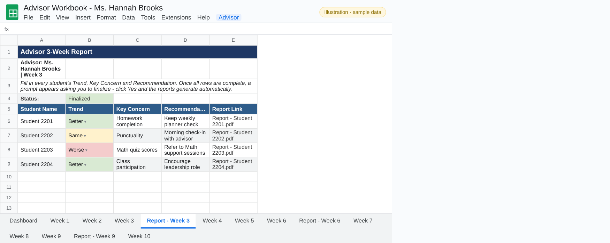

In weeks 3, 6 and 9 the advisor fills in each student's Trend, Key Concern and Recommendation. When every row is complete, the workbook asks them to confirm, then creates one PDF per student, links it in the Report Link column and marks the tab *Finalized*.

## Minutes of Meeting email

### Preview dialog

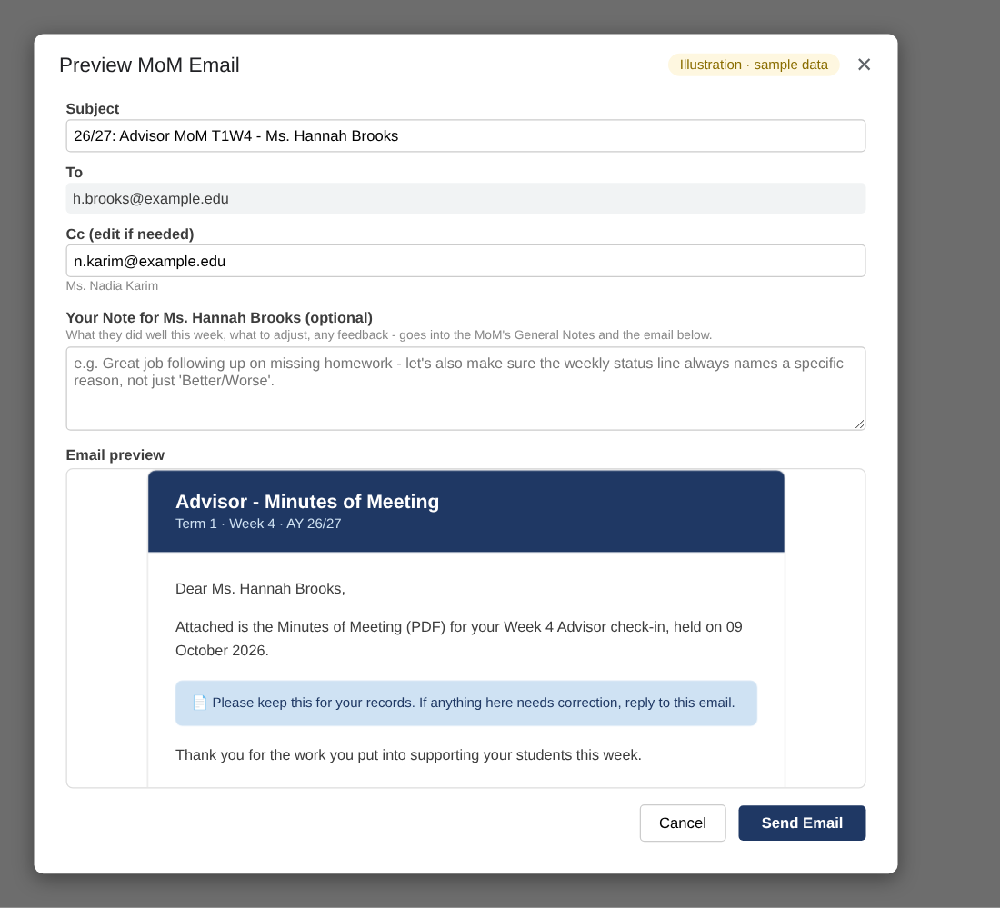

Before sending, the lead can edit the subject and CC list and add a personal note for the advisor, which also goes into the MoM's General Notes.

### MoM email

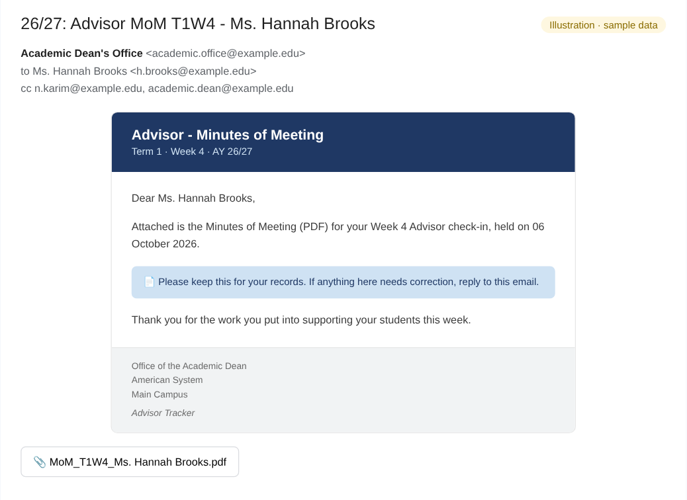

The email the advisor receives, with the MoM PDF attached and the footer from Settings.

## Confirmation messages

### Roster synced

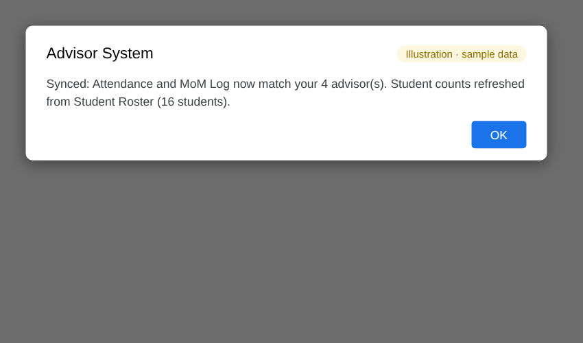

After **2. Generate Advisor Roster**.

### Workbooks generated

After **3. Generate Advisor Profiles + Workbooks**.

### Live status refreshed

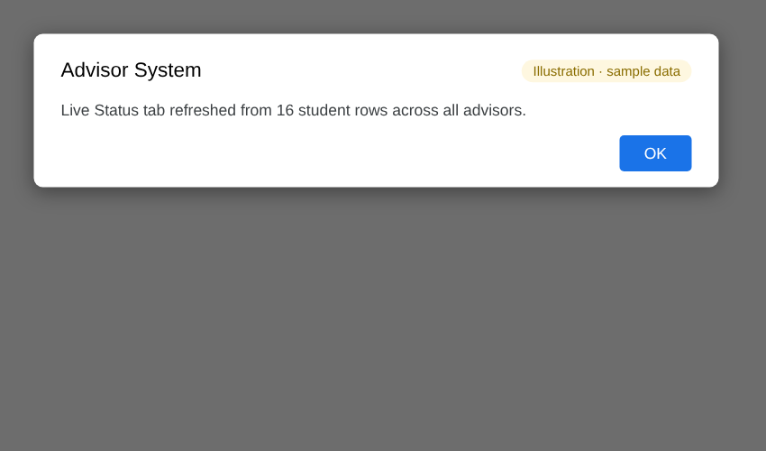

After **Pull Live Status from Advisor Workbooks**.

---

[← Back to the README](../README.md)
